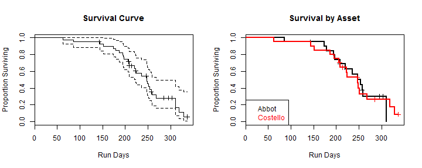

## Why Survival Analysis?

# You may be fooling yourself about reliability

Suppose we are an equipment supplier for projects in which hardware systems such as motors are installed, run until they fail or are removed for some other reason, and are then replaced. Our life data consists of a mix of times until failure, lives that ended without a failure, and lives that are ongoing. Let's look at a data set of 40 such lives from two projects or "Assets", with run days and variable indicating whether a failure ocurred. What are some ways to summarize these data?


```r
load("static_life_data.RData") # comes in as life_data.df
knitr::kable(xtabs(~ life_data.df$Asset + life_data.df$Failed), 
             caption="Lives by Project Name and Failed Status")
```


|         | FALSE| TRUE|
|:--------|-----:|----:|
|Abbot    |     6|   14|
|Costello |     5|   15|


---

## Some "Common-Sense" Methods

People try to average total time per failure, or just the average of the failures:


```r
load("static_life_data.RData") # comes in as life_data.df
paste("Total Run Days per Failure:", with(life_data.df, round(sum(RDays)/sum(Failed==TRUE))))
```

```
## [1] "Total Run Days per Failure: 314"
```

If there are many lives that are "censored" (meaning they did not run until failure) then this method can lead to absurd results. The longest life in this data set is 336 days. It seems odd for 314 days to be a typical life. 

```r
load("static_life_data.RData") # comes in as life_data.df
paste("Average Run Days of Failed Motors:", round(mean(life_data.df$RDays[life_data.df$Failed == TRUE])))
```

```
## [1] "Average Run Days of Failed Motors: 220"
```

This average tells us something about the motors that failed, but it ignores all the motors that didn't fail, including several with lives exceeding this average.

--- .class #id 

## Survival Analysis Makes More Sense
Using standard methods such as the survfit function in the R statistical programming language to produce [Kaplan-Meier estimates](http://en.wikipedia.org/wiki/Kaplan-Meier_estimator) of reliability produces compact and useful information, such as this survival table, summarized at specific times:


```r
load("static_life_data.RData") # comes in as life_data.df
library(survival)
stat1.fit <- survfit(Surv(time=RDays, event=Failed) ~ 1, life_data.df)
summary(stat1.fit, time=c(90, 180, 270, 365))
```

```
## Call: survfit(formula = Surv(time = RDays, event = Failed) ~ 1, data = life_data.df)
## 
##  time n.risk n.event survival std.err lower 95% CI upper 95% CI
##    90     38       2    0.950  0.0345        0.885        1.000
##   180     33       4    0.847  0.0574        0.742        0.968
##   270      8      19    0.283  0.0800        0.163        0.492
```

Since the method has been standardized for many years, it is available in many software products ... _if you know how to use those products!_

---

## There's an App for that!

The [Survival Analysis Calculator](http://dhimrich.shinyapps.io/CourseraSurvival/) puts the power and convenience of survival analysis with R in the hands of anyone with a web browser. Future versions will enable users to upload data sets and select more options for output. Please give the demonstrator a try, and see how easy it is to produce survival tables and standard survival curve plots that are so helpful in visualizing reliability peformance:

 

The GitHub repository for this RStudio Shiny App is [here](https://github.com/dhimrich/CourseraSurvivalApp), and I'd like to hear what you think!
