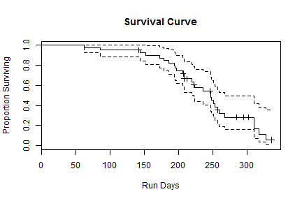

## Why Survival Analysis?

# You may be fooling yourself about reliability


Suppose we are an equipment supplier for projects in which hardware systems such as motors are installed, run until they fail or are removed for some other reason, and are then replaced. Our life data consists of a mix of times until failure, lives that ended without a failure, and lives that are ongoing. Let's look at a data set of 40 such lives from two projects or "Assets", with run days and variable indicating whether a failure ocurred. What are some ways to summarize these data?


```r
load("static_life_data.RData") # comes in as life_data.df
knitr::kable(xtabs(~ life_data.df$Asset + life_data.df$Failed), caption="Lives by Project Name and Failed Status")
```


|         | FALSE| TRUE|
|:--------|-----:|----:|
|Abbot    |     6|   14|
|Costello |     5|   15|


---

## Some "Common-Sense" Methods

People try to average total time per failure, or just the average of the failures:


```r
load("static_life_data.RData") # comes in as life_data.df
paste("Total Run Days per Failure:", with(life_data.df, round(sum(RDays)/sum(Failed==TRUE))))
```

```
## [1] "Total Run Days per Failure: 314"
```

If there are many lives that are "censored" (meaning they did not run until failure) then this method can lead to absurd results. The longest life in this data set is 336 days. It seems odd for 314 days to be a typical life. 


```r
paste("Average Run Days of Failed Motors:", round(mean(life_data.df$RDays[life_data.df$Failed == TRUE])))
```

```
## [1] "Average Run Days of Failed Motors: 220"
```

This average tells us something about the motors that failed, but it ignores all the motors that didn't fail, including several with lives exceeding this average.

--- .class #id 

## Slide 4 Title Here


```r
load("static_life_data.RData") # comes in as life_data.df
library(survival)
stat1.fit <- survfit(Surv(time=RDays, event=Failed) ~ 1, life_data.df)
summary(stat1.fit)
```

```
## Call: survfit(formula = Surv(time = RDays, event = Failed) ~ 1, data = life_data.df)
## 
##  time n.risk n.event survival std.err lower 95% CI upper 95% CI
##    63     40       1   0.9750  0.0247      0.92780        1.000
##    86     39       1   0.9500  0.0345      0.88480        1.000
##   144     37       1   0.9243  0.0420      0.84553        1.000
##   152     36       1   0.8986  0.0481      0.80922        0.998
##   173     35       1   0.8730  0.0531      0.77486        0.984
##   179     34       1   0.8473  0.0574      0.74192        0.968
##   186     33       1   0.8216  0.0611      0.71011        0.951
##   194     32       1   0.7959  0.0644      0.67922        0.933
##   195     31       1   0.7703  0.0672      0.64913        0.914
##   197     30       1   0.7446  0.0697      0.61973        0.895
##   206     29       1   0.7189  0.0719      0.59094        0.875
##   208     27       2   0.6657  0.0758      0.53251        0.832
##   220     23       1   0.6367  0.0778      0.50107        0.809
##   223     22       1   0.6078  0.0795      0.47034        0.785
##   224     20       1   0.5774  0.0811      0.43841        0.760
##   236     19       1   0.5470  0.0823      0.40724        0.735
##   247     17       2   0.4827  0.0843      0.34274        0.680
##   248     15       1   0.4505  0.0846      0.31176        0.651
##   251     14       1   0.4183  0.0845      0.28160        0.621
##   253     13       1   0.3861  0.0839      0.25226        0.591
##   257     12       1   0.3539  0.0828      0.22375        0.560
##   259     10       1   0.3185  0.0817      0.19263        0.527
##   268      9       1   0.2832  0.0800      0.16280        0.492
##   310      5       2   0.1699  0.0784      0.06875        0.420
##   318      3       1   0.1133  0.0698      0.03385        0.379
##   328      2       1   0.0566  0.0531      0.00901        0.356
```


---

## Slide 5


```r
load("static_life_data.RData") # comes in as life_data.df
library(survival)
stat1.fit <- survfit(Surv(time=RDays, event=Failed) ~ 1, life_data.df)
plot(stat1.fit, main="Survival Curve", xlab="Run Days", ylab="Proportion Surviving")
```

 


